## Android client for [Swing Music](https://github.com/swingmx/swingmusic)

This project is currently in its early development stages as the [Swing Music team](https://github.com/orgs/swingmx/people) is diligently working to deliver a beta version as soon as possible.

<table>
  <tr>
    <td>
      
    </td>
    <td>
      
    </td>
  </tr>
  
  <tr>
    <td>
      
    </td>
    <td>
      
    </td>
  </tr>
</table>

### Module Graph

```mermaid
%%{
  init: {
    'theme': 'dark'
  }
}%%

graph LR
  :feature:home -- debugAndroidTestCompileClasspath --> :auth
  :feature:home -- debugAndroidTestCompileClasspath --> :core
  :feature:home -- debugAndroidTestCompileClasspath --> :network
  :feature:home -- debugAndroidTestCompileClasspath --> :uicomponent
  :feature:home -- debugUnitTestCompileClasspath --> :auth
  :feature:home -- debugUnitTestCompileClasspath --> :core
  :feature:home -- debugUnitTestCompileClasspath --> :network
  :feature:home -- debugUnitTestCompileClasspath --> :uicomponent
  :feature:home -- implementation --> :auth
  :feature:home -- implementation --> :core
  :feature:home -- implementation --> :network
  :feature:home -- implementation --> :uicomponent
  :feature:home -- releaseUnitTestCompileClasspath --> :auth
  :feature:home -- releaseUnitTestCompileClasspath --> :core
  :feature:home -- releaseUnitTestCompileClasspath --> :network
  :feature:home -- releaseUnitTestCompileClasspath --> :uicomponent
  :feature:artist -- debugAndroidTestCompileClasspath --> :auth
  :feature:artist -- debugAndroidTestCompileClasspath --> :core
  :feature:artist -- debugAndroidTestCompileClasspath --> :network
  :feature:artist -- debugAndroidTestCompileClasspath --> :uicomponent
  :feature:artist -- debugAndroidTestCompileClasspath --> :feature:player
  :feature:artist -- debugAndroidTestCompileClasspath --> :feature:common
  :feature:artist -- debugUnitTestCompileClasspath --> :auth
  :feature:artist -- debugUnitTestCompileClasspath --> :core
  :feature:artist -- debugUnitTestCompileClasspath --> :network
  :feature:artist -- debugUnitTestCompileClasspath --> :uicomponent
  :feature:artist -- debugUnitTestCompileClasspath --> :feature:player
  :feature:artist -- debugUnitTestCompileClasspath --> :feature:common
  :feature:artist -- implementation --> :auth
  :feature:artist -- implementation --> :core
  :feature:artist -- implementation --> :network
  :feature:artist -- implementation --> :uicomponent
  :feature:artist -- implementation --> :feature:player
  :feature:artist -- implementation --> :feature:common
  :feature:artist -- releaseUnitTestCompileClasspath --> :auth
  :feature:artist -- releaseUnitTestCompileClasspath --> :core
  :feature:artist -- releaseUnitTestCompileClasspath --> :network
  :feature:artist -- releaseUnitTestCompileClasspath --> :uicomponent
  :feature:artist -- releaseUnitTestCompileClasspath --> :feature:player
  :feature:artist -- releaseUnitTestCompileClasspath --> :feature:common
  :uicomponent -- debugAndroidTestCompileClasspath --> :core
  :uicomponent -- debugUnitTestCompileClasspath --> :core
  :uicomponent -- implementation --> :core
  :uicomponent -- releaseUnitTestCompileClasspath --> :core
  :feature:player -- debugAndroidTestCompileClasspath --> :auth
  :feature:player -- debugAndroidTestCompileClasspath --> :core
  :feature:player -- debugAndroidTestCompileClasspath --> :database
  :feature:player -- debugAndroidTestCompileClasspath --> :network
  :feature:player -- debugAndroidTestCompileClasspath --> :uicomponent
  :feature:player -- debugUnitTestCompileClasspath --> :auth
  :feature:player -- debugUnitTestCompileClasspath --> :core
  :feature:player -- debugUnitTestCompileClasspath --> :database
  :feature:player -- debugUnitTestCompileClasspath --> :network
  :feature:player -- debugUnitTestCompileClasspath --> :uicomponent
  :feature:player -- implementation --> :auth
  :feature:player -- implementation --> :core
  :feature:player -- implementation --> :database
  :feature:player -- implementation --> :network
  :feature:player -- implementation --> :uicomponent
  :feature:player -- releaseUnitTestCompileClasspath --> :auth
  :feature:player -- releaseUnitTestCompileClasspath --> :core
  :feature:player -- releaseUnitTestCompileClasspath --> :database
  :feature:player -- releaseUnitTestCompileClasspath --> :network
  :feature:player -- releaseUnitTestCompileClasspath --> :uicomponent
  :auth -- debugAndroidTestCompileClasspath --> :database
  :auth -- debugAndroidTestCompileClasspath --> :core
  :auth -- debugAndroidTestCompileClasspath --> :uicomponent
  :auth -- debugUnitTestCompileClasspath --> :database
  :auth -- debugUnitTestCompileClasspath --> :core
  :auth -- debugUnitTestCompileClasspath --> :uicomponent
  :auth -- implementation --> :database
  :auth -- implementation --> :core
  :auth -- implementation --> :uicomponent
  :auth -- releaseUnitTestCompileClasspath --> :database
  :auth -- releaseUnitTestCompileClasspath --> :core
  :auth -- releaseUnitTestCompileClasspath --> :uicomponent
  :feature:folder -- debugAndroidTestCompileClasspath --> :auth
  :feature:folder -- debugAndroidTestCompileClasspath --> :core
  :feature:folder -- debugAndroidTestCompileClasspath --> :network
  :feature:folder -- debugAndroidTestCompileClasspath --> :uicomponent
  :feature:folder -- debugAndroidTestCompileClasspath --> :feature:player
  :feature:folder -- debugAndroidTestCompileClasspath --> :feature:album
  :feature:folder -- debugUnitTestCompileClasspath --> :auth
  :feature:folder -- debugUnitTestCompileClasspath --> :core
  :feature:folder -- debugUnitTestCompileClasspath --> :network
  :feature:folder -- debugUnitTestCompileClasspath --> :uicomponent
  :feature:folder -- debugUnitTestCompileClasspath --> :feature:player
  :feature:folder -- debugUnitTestCompileClasspath --> :feature:album
  :feature:folder -- implementation --> :auth
  :feature:folder -- implementation --> :core
  :feature:folder -- implementation --> :network
  :feature:folder -- implementation --> :uicomponent
  :feature:folder -- implementation --> :feature:player
  :feature:folder -- implementation --> :feature:album
  :feature:folder -- releaseUnitTestCompileClasspath --> :auth
  :feature:folder -- releaseUnitTestCompileClasspath --> :core
  :feature:folder -- releaseUnitTestCompileClasspath --> :network
  :feature:folder -- releaseUnitTestCompileClasspath --> :uicomponent
  :feature:folder -- releaseUnitTestCompileClasspath --> :feature:player
  :feature:folder -- releaseUnitTestCompileClasspath --> :feature:album
  :network -- debugAndroidTestCompileClasspath --> :auth
  :network -- debugAndroidTestCompileClasspath --> :core
  :network -- debugAndroidTestCompileClasspath --> :database
  :network -- debugUnitTestCompileClasspath --> :auth
  :network -- debugUnitTestCompileClasspath --> :core
  :network -- debugUnitTestCompileClasspath --> :database
  :network -- implementation --> :auth
  :network -- implementation --> :core
  :network -- implementation --> :database
  :network -- releaseUnitTestCompileClasspath --> :auth
  :network -- releaseUnitTestCompileClasspath --> :core
  :network -- releaseUnitTestCompileClasspath --> :database
  :app -- debugAndroidTestCompileClasspath --> :auth
  :app -- debugAndroidTestCompileClasspath --> :core
  :app -- debugAndroidTestCompileClasspath --> :network
  :app -- debugAndroidTestCompileClasspath --> :uicomponent
  :app -- debugAndroidTestCompileClasspath --> :feature:home
  :app -- debugAndroidTestCompileClasspath --> :feature:folder
  :app -- debugAndroidTestCompileClasspath --> :feature:player
  :app -- debugAndroidTestCompileClasspath --> :feature:artist
  :app -- debugAndroidTestCompileClasspath --> :feature:album
  :app -- debugAndroidTestCompileClasspath --> :feature:common
  :app -- debugUnitTestCompileClasspath --> :auth
  :app -- debugUnitTestCompileClasspath --> :core
  :app -- debugUnitTestCompileClasspath --> :network
  :app -- debugUnitTestCompileClasspath --> :uicomponent
  :app -- debugUnitTestCompileClasspath --> :feature:home
  :app -- debugUnitTestCompileClasspath --> :feature:folder
  :app -- debugUnitTestCompileClasspath --> :feature:player
  :app -- debugUnitTestCompileClasspath --> :feature:artist
  :app -- debugUnitTestCompileClasspath --> :feature:album
  :app -- debugUnitTestCompileClasspath --> :feature:common
  :app -- implementation --> :auth
  :app -- implementation --> :core
  :app -- implementation --> :network
  :app -- implementation --> :uicomponent
  :app -- implementation --> :feature:home
  :app -- implementation --> :feature:folder
  :app -- implementation --> :feature:player
  :app -- implementation --> :feature:artist
  :app -- implementation --> :feature:album
  :app -- implementation --> :feature:common
  :app -- releaseUnitTestCompileClasspath --> :auth
  :app -- releaseUnitTestCompileClasspath --> :core
  :app -- releaseUnitTestCompileClasspath --> :network
  :app -- releaseUnitTestCompileClasspath --> :uicomponent
  :app -- releaseUnitTestCompileClasspath --> :feature:home
  :app -- releaseUnitTestCompileClasspath --> :feature:folder
  :app -- releaseUnitTestCompileClasspath --> :feature:player
  :app -- releaseUnitTestCompileClasspath --> :feature:artist
  :app -- releaseUnitTestCompileClasspath --> :feature:album
  :app -- releaseUnitTestCompileClasspath --> :feature:common
  :database -- debugAndroidTestCompileClasspath --> :core
  :database -- debugUnitTestCompileClasspath --> :core
  :database -- implementation --> :core
  :database -- releaseUnitTestCompileClasspath --> :core
  :feature:album -- debugAndroidTestCompileClasspath --> :auth
  :feature:album -- debugAndroidTestCompileClasspath --> :core
  :feature:album -- debugAndroidTestCompileClasspath --> :network
  :feature:album -- debugAndroidTestCompileClasspath --> :uicomponent
  :feature:album -- debugAndroidTestCompileClasspath --> :feature:player
  :feature:album -- debugAndroidTestCompileClasspath --> :feature:artist
  :feature:album -- debugUnitTestCompileClasspath --> :auth
  :feature:album -- debugUnitTestCompileClasspath --> :core
  :feature:album -- debugUnitTestCompileClasspath --> :network
  :feature:album -- debugUnitTestCompileClasspath --> :uicomponent
  :feature:album -- debugUnitTestCompileClasspath --> :feature:player
  :feature:album -- debugUnitTestCompileClasspath --> :feature:artist
  :feature:album -- implementation --> :auth
  :feature:album -- implementation --> :core
  :feature:album -- implementation --> :network
  :feature:album -- implementation --> :uicomponent
  :feature:album -- implementation --> :feature:player
  :feature:album -- implementation --> :feature:artist
  :feature:album -- releaseUnitTestCompileClasspath --> :auth
  :feature:album -- releaseUnitTestCompileClasspath --> :core
  :feature:album -- releaseUnitTestCompileClasspath --> :network
  :feature:album -- releaseUnitTestCompileClasspath --> :uicomponent
  :feature:album -- releaseUnitTestCompileClasspath --> :feature:player
  :feature:album -- releaseUnitTestCompileClasspath --> :feature:artist

classDef android-library fill:#3BD482,stroke:#fff,stroke-width:2px,color:#fff;
classDef android-application fill:#2C4162,stroke:#fff,stroke-width:2px,color:#fff;
class :feature:home android-library
class :auth android-library
class :core android-library
class :network android-library
class :uicomponent android-library
class :feature:artist android-library
class :feature:player android-library
class :feature:common android-library
class :database android-library
class :feature:folder android-library
class :feature:album android-library
class :app android-application

```

